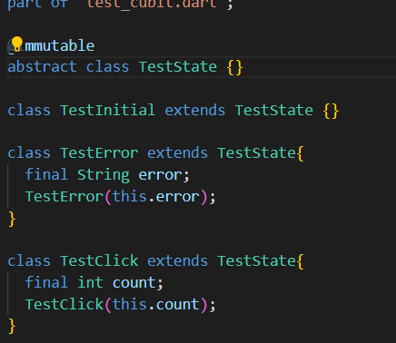
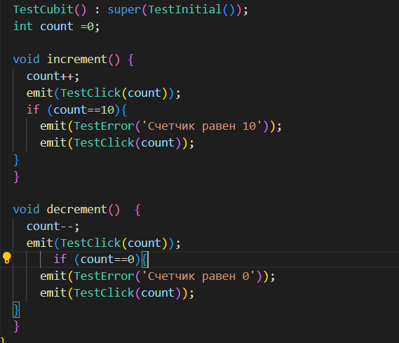
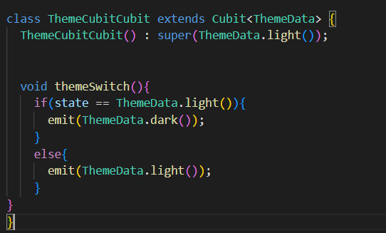
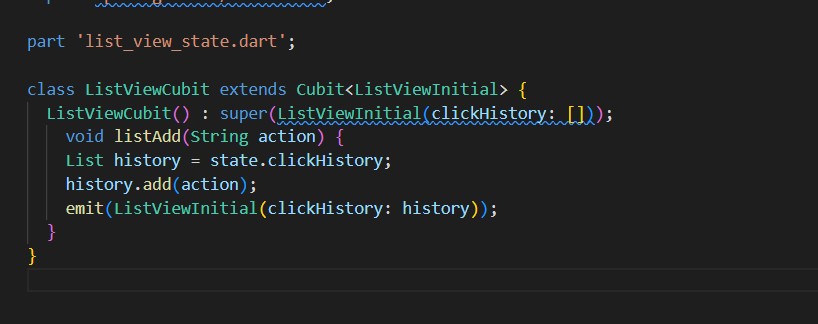
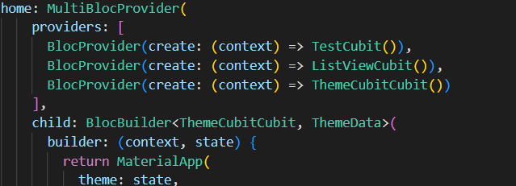
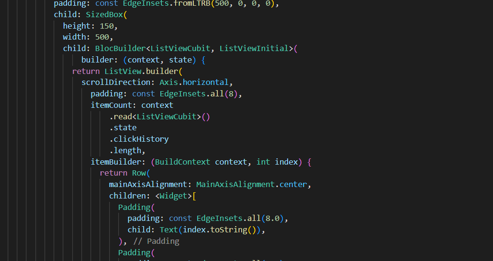
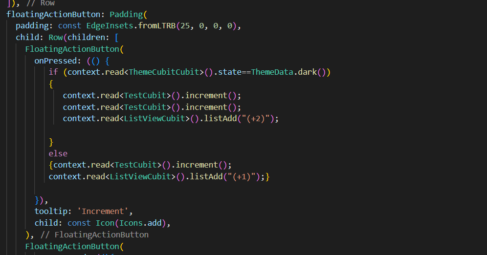
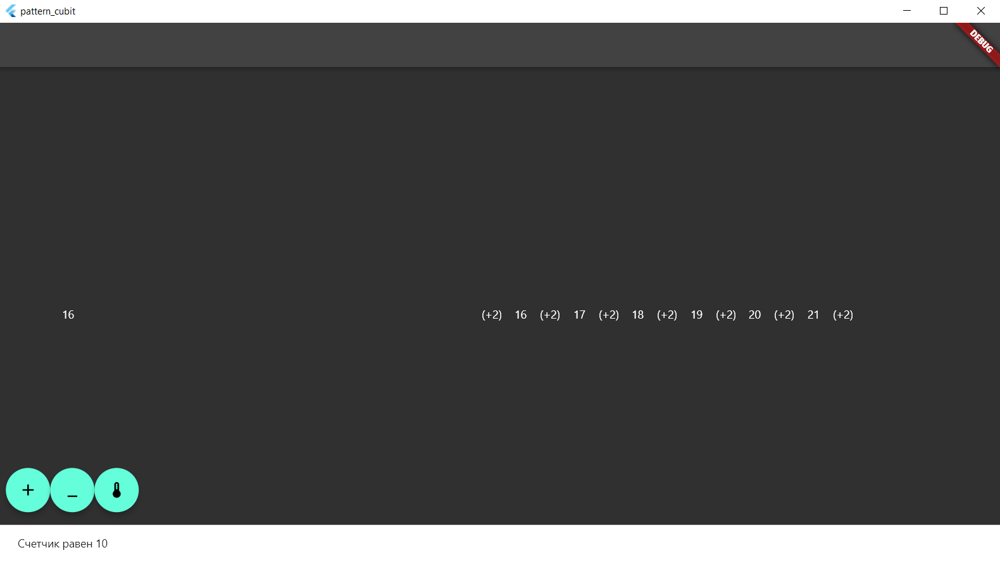

# Практическая работа №4
Цель работы: Создать проект с использованием Cubit.
Реализовать счетчик при нажатии на кнопку + осуществляет увеличение счетчика, при нажатии на кнопку - осуществляться уменьшение счетчика.
Если текущая тема устройства светлая то за одно нажатие должно +1 или -1.
Если текущая тема устройства темная то за одно нажатие должно  +2 или -2.
Каждое действие должно записываться в историю. История должна быть реализована через виджет ListView.
Ход работы:
Для реализации паттерна cubit создаем классы, содержащие в себе состояния.

Рисунок 22 – Состояния

Также необходимо создать класс, содержащий методы, которые будут изменять состояние окна.

Рисунок 23 – Счётчик

Рисунок 24 - Смена темы

Рисунок 25 – История

Переходим к созданию верстки. Инициализируем MultiBlocProvider для обработки сразу нескольких методов.
 

 

Рисунок 26 – MultiBlocProvider

Далее пропишем ListView для вывода истории.
 

Рисунок 27 – ListView

Кроме того, необходимо описать кнопки, вызывающие срабатывание методов.
 

 

Рисунок 28 – floatingActionButton

 

Рисунок 29 - Результат

Вывод: удалось создать проект с использованием Cubit.
